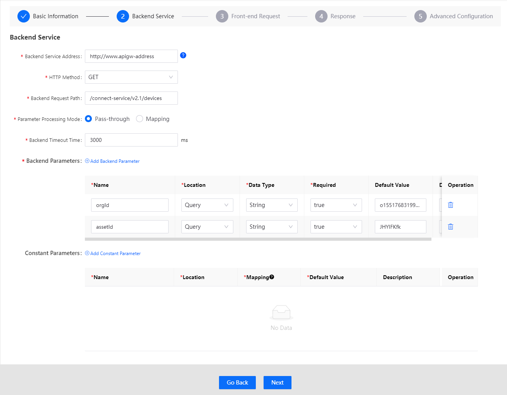

# Creating APIs

To publish your APIs onto EnOS and make them available for authorized consumers, you need to define your own APIs in the API Management page at first.

## Task Description

This article describes how to create an API in the API Management.

## Before You Start

- You own an EnOS account and the permissions to define APIs. See [Policies, Roles and Permissions](/docs/iam/en/2.0.9/access_policy).

## Procedure

### Creating API Groups

1. Select **API Management > My API**;

2. Click **New Group**, and complete the following fields:
   
   - Name: upper and lower case letters, numbers, hyphen (-) are supported and its length is limited within 32 characters;
   - Path
   - Description: limited within 140 characters.

3. Click **Save** to complete the creation;

   

### Basic Information

1. Click the API group you created and then click **Add API** in the page of **Group Overview**;
   
2. In the page of **API Basic Information**, complete the following fields and click **Next**:
   - API Name
   - API Type
     - Private API: the internal API only available within organization, such as test API 
     - EnOS API: the internal API that is exposed to the customers i.e. EnOS API
     - APIs developed by EnOS partners: the internal or external API in the domain, such as weather service API
   - Authentication Mode
   - API Description

### Backend Service

Configurate the backend service for the API. Take example of adding [Get Device](/docs/api/en/2.0.9/connect/get_device.html). Configurate the parameters according to the API documentation.

1. In the **Backend Service** page, complete the following fields:
   - Backend Service Address: HTTP address and port that actually provide the API service.

   - HTTP Method: GET, POST, PUT and DELETE are supported on EnOS currently.

   - Backend Request Path: The path where the resource provide the API service is located.

   - Parameter Processing Mode: Processing mode of API gateway for incoming parameters, where **Pass-through** and **Mapping** are supported
      - Mapping: When the API gateway receives the API request from an API consumer, it converts the request into a format required by the backend through a mapping relationship.
      - Passthrough: After receiving the API request, the API gateway forwards it directly to the backend service rather than processing it.
   
   - Backend Timeout Time: The response time of API gateway invoking the API backend service when receiving the API request. That is, the time from when the API gateway requests the backend service to that the API gateway receives the response. The time is calculated in millisecond. If the response time exceeds this value, the API gateway will stop requesting the backend service and return an appropriate error message to the user.
   
   - Backend Parameters: The parameters that are required to invoke the backend services. Take example of the API [Get Device](/docs/api/en/2.0.9/connect/get_device.html), the parameters includes `orgId` and `assetId`.
      - Name
      - Location: The location of the parameter in the request, which can be Head, Query or Path.
      - Data Type: Type of the field, for which String, Int, Long, Float, Double, Boolean, Binary, Date, DateTime and Password are supported.
      - Required: It is required or optional.
      - Default Value
      - Description
   
   - Constant Parameters: These parameters are invisible to API consumers. However the API gateway will add these parameters to the specified location in the request when transferring the request, and then pass the request to the backend service to meet the backend business needs. 
      - Name
      - Location: The location of the constant parameter in the request, which can be Head or Query.
      - Mapping
      - Default Value
      - Description

2. Click **Next** when complete.

### Front-end Request

Configurate front-end service for the API. Control the API version according to the naming standard of the API version iteration. If the **Pass-through** is selected as **Parameter Processing Mode** in the **Backend Service**, then the **Request Path** in **Front-end Request** is consistent with that in **Backend Service**.

1. Complete the following fields and click **Next**:
   - Version: To identify different versions of the API. Different versions of the same API can be mounted under the same API group. 

   - Request Path: The path used by the API consumer to invoke the API. If **Parameter Processing Mode** in the **Backend Service** is selected as **Mapping**, the request path can be set by the API developer as needed; if **Pass-through** is selected, the request path must be consistent with that in **Backend Service**.

   - Front-end Parameters: When **Mapping** is selected as **Parameter Processing Mode**, you need to set the parameter definition of the API request. The API parameter definition contains the following fields:
      - Name: Name of the parameter to be displayed to the API consumer.
      - Backend Parameter Name: The backend parameter to which the parameter is mapped.
      - Location: The location of the parameter in the request.
      - Backend Parameter Location: The location of the corresponding backend parameter in the request forwarded by the API gateway.
      - Date Type: Type of the field.
      - Backend Data Type: The corresponding backend data type.
      - Required: It is required or optional.
      - Default Value
      - Description
      - Operation

   Among the above fields, some fields, including **Name** **Required**, **Default Value** and **Description**, can be set by the user. Other fields are automatically matched with corresponding fields of the **Backend Parameters** in **Backend Service**.

2. Click **Next** when complete.

### Reponse

1. In the page of **Reponse**, complete the response informatoin and error code.
   - Content Type

   - Successful Samples

   - Falure Samples: Optional

   - Error Code

2. Click **Next** when complete.

### Advanced Configuration

API Management provides rich plugin services for every API. Click "+" under **Advanced Configuration** to add plugin. Currently available plugin services include traffic control, black and white lists, and MOCK tests.

1. In the **Advanced Configuration** page, you can add additional configurations for the API to be published in EnOS. The EnOS currently supports the following functions:
   - Network Traffic Control
     - Rate Limiting
     - Request Size Limiting

   - IP Restriction

   - Mock

2. Click **OK** when complete.

## Result

In the page of **Group Overview**, you can see the API that has been created successfully, and its status is shown as **Offline** with the **Type** as **Private**.

## Next Step

[Deploying APIs](deploying_api)
