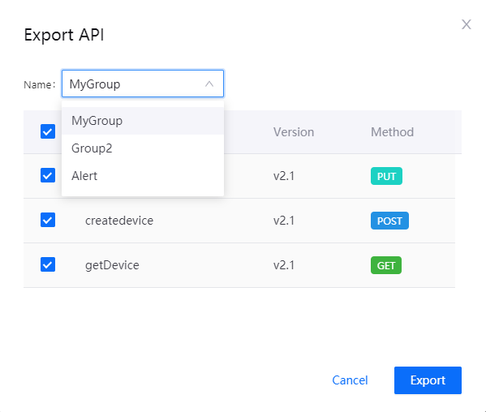

# Exporting APIs

User can export the APIs, then transfer the APIs to another EnOS environment, or do APIs backup. All or part of the APIs can be exported to JSON file, then imported to EnOS. About how to import APIs, refer to [Importing APIs](importing_api).

## Task Description

This article describes how to export APIs configuration in APIM.

## Prerequisites

- You own an EnOS account and the permissions to define APIs. See [Policies, Roles and Permissions](/docs/enos/en/2.0.9/iam/concept/access_policy.html).
- You have complete the task [Creating APIs](creating_api).

## Procedure

1. Select **API Management > My API**, and click **Export API**。

2. Select the group where the APIs you want to export are located. Check the APIs you want to export, and click **Export**.
   
   

## Results

The APIs configuration in the selected group is saved in a JSON file.

## Next Step

[Importing APIs](importing_api)