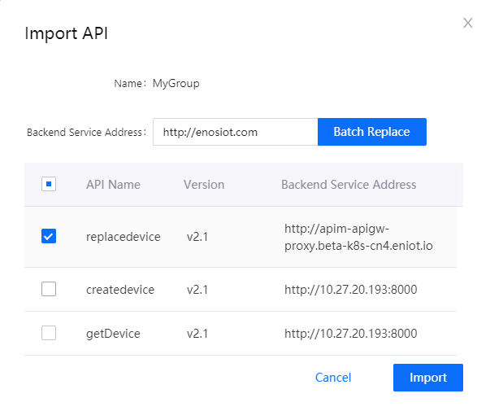

# Importing APIs

Users can import the APIs configuration file (JSON) which was previously exported into EnOS for API batch creating. About how to exporting APIs, refer to [Exporting APIs](exporting_api).

## Task Description

This article describes how to do API batch creating with JSON file in APIM.

## Prerequisites

- You own an EnOS account and the permissions to define APIs. See [Policies, Roles and Permissions](/docs/iam/en/2.0.9/access_policy).
- You have already exported and saved APIs configuration file from APIM. Refer to [Exporting APIs](exporting_api).

## Procedure

1. Select **API Management > My API**,click **Import API**.

2. Select the JSON file that was previously exported from EnOS.

3. Select the APIs you want to import. You can also batch replace the backend service address for the imported APIs. Then click **Import**.

   

## Results

The new imported API group is listed in **My API**. Click the group to view all the imported APIs. The new imported APIs are **Offline** and **Private**.

## Next Step

[Deploying API](deploying_api)