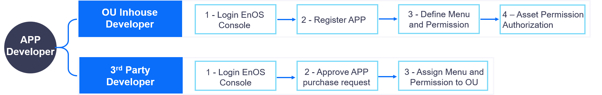

Application Developer
=================
An application developer can be the inhouse developer of an enterprise or organization, or a third-party application developer. The application developer needs to register applications on EnOS Console and make appropriate configuration so that they can be synchronized to and displayed in the Application Portal.

The tasks and workflow of an application developer managing applications on EnOS Console are shown as follows:

.. toctree::
   :maxdepth: 1
   :caption: How-to's

   developing_apps
