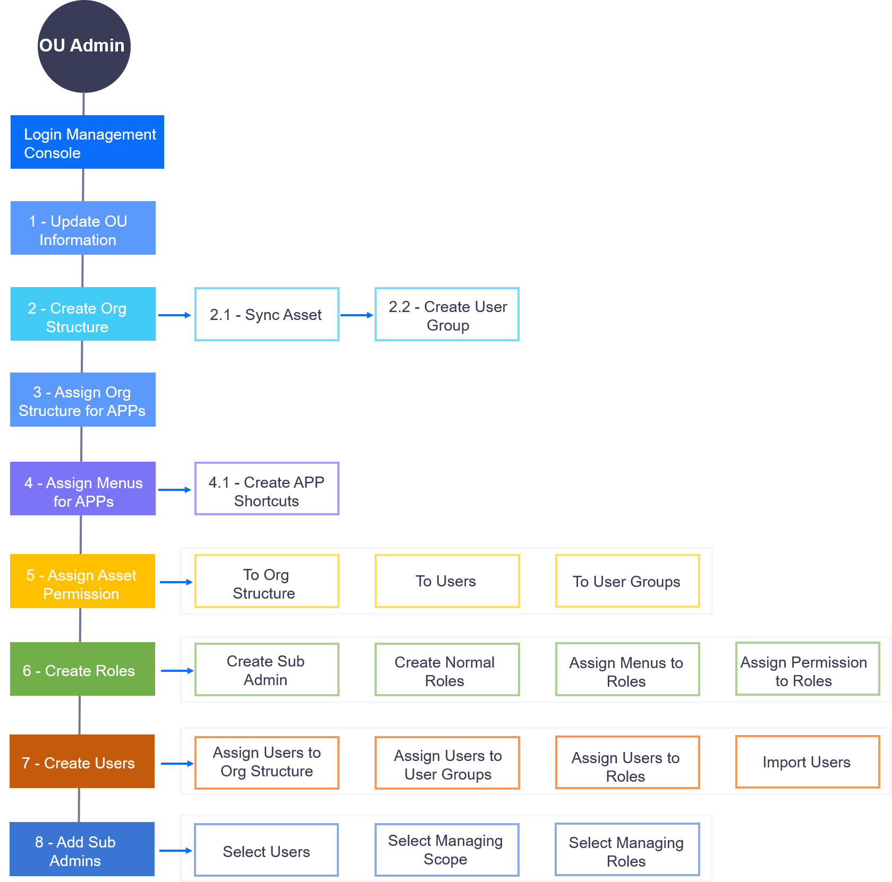

OU Administrator
=================

With the account created and assigned by the system administrator, the OU administrator is responsible for the overall management of the classification, users and permissions, and assets for the applications of an enterprise or organization.

The tasks and workflow of an OU administrator in the admin console are shown as follows:

.. toctree::
   :maxdepth: 1
   :caption: How-to's

   console_intro
   managing_ou
   managing_apps
   creating_app_shortcut
   managing_roles
   managing_users
   managing_user_groups
   managing_asset_permission
   managing_sub_admin
   ou_settings
