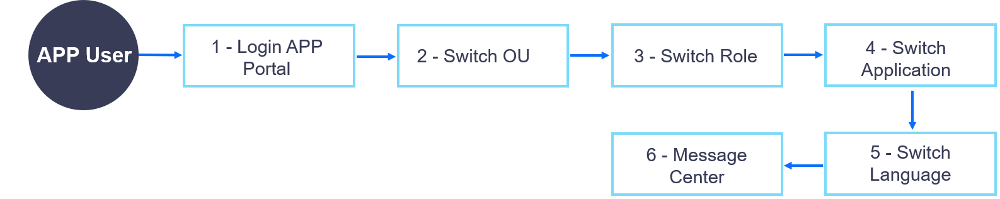

OU User
=================

OU Users are the actual user of applications in the Application Portal. Users log in the Application Portal with the accounts created by the OU administrator and access applications that are developed or bought by the enterprise or organization. Through the applications, users can view asset information and data to which they have access and take authorized operations.

The tasks and workflow of a user in the application portal are shown as follows:

.. toctree::
   :maxdepth: 1
   :caption: How-to's

   portal_intro
   managing_messages

