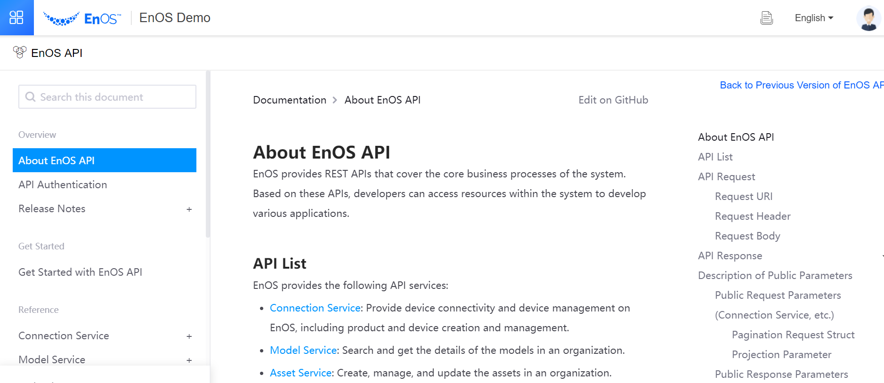
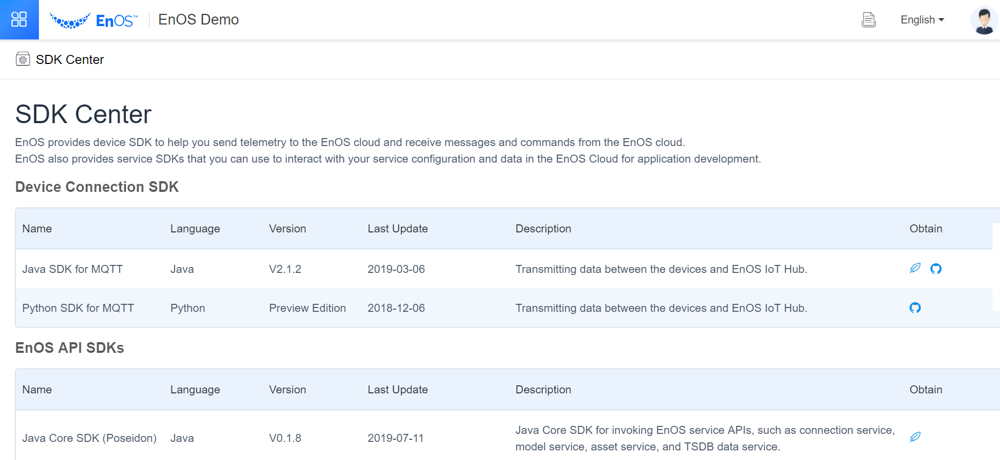

# EnOS APIs and SDKs

# EnOS APIs

EnOS provides various APIs that expose a lot of EnOS service capabilities and access to different types of data.

- Connection Service: Provide device connectivity and device management on EnOS, including product and device creation and management.

- Model Service: Search and get the details of the models in an organization.

- Asset Service: Create, manage, and update the assets in an organization.

- Alert Service: Search and manage asset alerts.

- Asset Tree Service: Create, manage, update, and search assets trees in an organization.

- TSDB Data Service: Access the stored asset data.

- TSDB Policy Service: Access TSDB storage configuration information.

- IAM Service Overview: Manage user account lifecycle, authenticate user identities, and control the access rights to the resources in EnOS.

- Common File Service: Manage files on EnOS.

To get started with EnOS APIs, go to **EnOS Console > EnOS API**.



## EnOS SDKs

EnOS provides official SDKs for application developers to perform various tasks such as connecting devices, ingesting data, accessing data and services on EnOS.

EnOS SDKs can be accessed from the **SDK Center** in the EnOS Console.




<!--

## EnOS Device SDKs

The **EnOS Device SDKs** provide various device connection and management interfaces, such as device registration, device data ingestion, and device control, to help you send device telemetries to the EnOS Cloud and receive data or commands from the cloud.

### EnOS Device SDK for MQTT for Java

- [Include dependency in Maven project](https://mvnrepository.com/artifact/com.envisioniot/enos-mqtt/2.1.2)
- [Obtain source code from GitHub](https://github.com/EnvisionIot/enos-mqtt-sdk-java)

### EnOS Device SDK for MQTT for Python (Preview Edition)

- Install from PIP

  ```
  pip install enos-mqtt-sdk-python
  ```

- [Obtain source code from GitHub](https://github.com/EnvisionIot/enos-mqtt-sdk-python)


## EnOS API Core SDKs

The **EnOS API Core SDKs** provide the basic environment for calling EnOS APIs, which support both synchronous and asynchronous API requests.

### Java Core SDK (Poseidon)

- [Include dependency in Maven project](https://mvnrepository.com/artifact/com.envisioniot/apim-poseidon/0.1.7)


View [Getting Started with EnOS API](/docs/api/en/latest/gettingstarted.html) for more information


### Python Core SDK (Athena)

- Install from PIP:

  ```
  pip install aphrodite
  ```


View [Getting Started with EnOS API](/docs/api/en/latest/gettingstarted.html) for more information


## EnOS IoT SDK for C

The **EnOS IoT SDK for C** supports the following functions APIs for X.509 certificate-based authentication, data transmission between devices and cloud through MQTT protocol, and EnOS Cloud services.

- [Obtain source code from GitHub](https://github.com/EnvisionIot/enos-iot-sdk-c)


## EnOS Data Subscription SDK

EnOS Data Subscribe SDK supports consuming the subscribed asset real-time data and alert data.

- [Include dependency in Maven project](https://mvnrepository.com/artifact/com.envisioniot/enos-subscribe/2.2.0)

## Related Links

- [Getting Started with EnOS SDKs](gettingstarted_sdk)


## EnOS Appframework Mars

The EnOS Appframework Mars SDK provides a framework and a set of easy-to-use APIs for Application Registration (including permission authentication method) and application development.

- [Include dependency in Maven project](https://mvnrepository.com/artifact/com.envisioniot/enos-appframework-mars/0.1.0)

-->